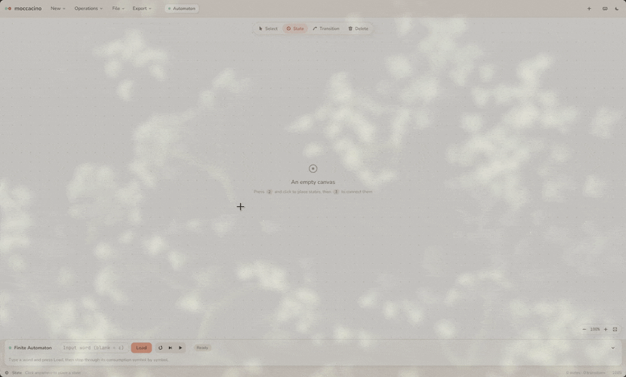

# moccacino

moccacino is a desktop workbench for automata theory and formal languages. Draw machines on a canvas, run them step by step, and apply the classic conversions, all in one interface with light and dark themes. It is written in Rust with the [Iced](https://github.com/iced-rs/iced) GUI library.

<p align="center">
  
</p>

## Features

| Family | What you can do |
|---|---|
| **Finite automata** (DFA / NFA) | ε-transitions, step-by-step runs (nondeterministic branches shown as lanes), NFA → DFA (subset construction), Hopcroft minimization, export to a regular expression |
| **Pushdown automata** | `input;pop/push` transitions, run panel with a live stack and input ribbon, deterministic or nondeterministic execution |
| **Turing machines** | single or multi-tape, run panel with tape strips, breadth-first nondeterministic exploration |
| **Context-free grammars** | text editor (`S -> a S b \| ε`), CYK membership, leftmost derivations, Chomsky Normal Form, right-linear grammar ↔ automaton, CFG → PDA |
| **Regular expressions** | `\|`, concatenation, `*`, `+`, `?`, grouping, `\` escapes and `ε`, compiled into an automaton (Thompson construction) |

Across every family:

- **Tabs**: each tab holds one machine or grammar. Tabs with unsaved changes show a small dot, and closing a tab or the app with unsaved work asks you first.
- **`.ce` files**: plain-text files that can hold any mix of machines and grammars. When you load one, every entity opens in its own tab (see [`docs/ce-format.md`](docs/ce-format.md)).
- **Exports**:
  - LaTeX/TikZ code for the machine you drew.
  - A regular expression for finite automata.
  - An LLM prompt that turns a photo of a diagram into a `.ce` file (see [`docs/vision-llm-prompt.md`](docs/vision-llm-prompt.md)).

## Installation

### With Nix (recommended)

The flake provides the toolchain and every graphics library (X11, Wayland, Vulkan, Mesa):

```bash
nix run github:areummon/moccacino    # run without cloning

git clone https://github.com/areummon/moccacino.git
cd moccacino
nix run .        # build and run
nix build        # produces ./result/bin/moccacino
nix develop      # dev shell (or let direnv load it through the committed .envrc)
```

### With Cargo

You need Rust and Cargo. The flake pins nightly, but stable should also work. On Linux you also need the usual X11/Wayland/Vulkan development libraries.

```bash
git clone https://github.com/areummon/moccacino.git
cd moccacino
cargo run --release
```

A plain `cargo run` works too. The dev profile optimizes dependencies, so the debug build stays smooth.

> [!NOTE]
> Rendering needs a working Vulkan or EGL driver. If the app panics while creating the graphics instance, it is a driver/environment problem. Try running it from the Nix dev shell.

## Getting started

On launch, choose a module (Finite, Pushdown, Turing or Grammar) from the startup picker. More tabs of any kind can be opened later from **New** or with `Ctrl+T`.

The header holds the **New**, **Operations**, **File** and **Export** menus, the tabs, and the theme toggle. The canvas has a floating tool palette. When a machine has a run panel, it docks below the canvas. The status bar shows whether the machine is deterministic and whether it is ready to run.

### Drawing machines

Editing is tool-based, in the style of JFLAP:

| Tool | Key | What it does |
|---|---|---|
| **Select** | `1` | Drag a state to move it, or drag empty space to pan. Double-click a state to rename it; click a transition to edit its label. `Shift`+click toggles accepting, `Alt`+click makes a state initial. |
| **State** | `2` | Click empty space to add a state. |
| **Transition** | `3` | Click the source state, then the target state. |
| **Delete** | `4` | Click a state or transition to remove it. |

`Tab` switches between Select and Delete. Holding `Delete` gives you the Delete tool while the key is held, and `Esc` returns to Select.

To move around the canvas, zoom with `Ctrl`+wheel or `Ctrl` `+`/`−`. `Ctrl+0` resets the zoom and `F` fits the machine to the view.

### Transition labels

| Family | Format | Example |
|---|---|---|
| Finite | one symbol; `ε` (or blank) is an ε-move | `a` |
| Pushdown | `input;pop/push`: `ε` as input reads nothing, and as pop or push it does nothing | `a;Z/AZ` |
| Turing | `read;write/dir` with dir ∈ {`L`, `R`, `S`}; multi-tape labels join one segment per tape with commas | `a;X/R,_;*/L` |

For pushdown pushes, `AZ` pushes `Z` and then `A`, so `A` ends up on top. Use commas for multi-character stack symbols: `a,S,b` leaves `a` on top.

A malformed label does not crash anything. The status bar points it out, and runs skip it.

### Running machines

Every machine tab has a run panel:

1. Type an input and press **Load**.
2. Press **Step** (`→`) or **Play** (`Space`).

Finite automata show an input ribbon, pushdown automata show a stack lane plus the ribbon, and Turing machines show tape strips. Nondeterministic machines show their branches as parallel lanes that advance level by level.

To just get a yes/no answer, use **Operations → Check input…**. It works for every family; grammar tabs answer with CYK.

### Operations

- **NFA → DFA**: subset construction; the result opens in a new tab.
- **Minimize DFA**: Hopcroft's algorithm; the result opens in a new tab.
- **Build from regex…**: compiles a regular expression into an automaton in a new tab.
- **Check input…**: answers accept or reject for a single word.

### Grammars

Grammar tabs are text-based. Write one production group per line. The first left-hand side is the start symbol, `|` separates alternatives, and `ε` (or an empty alternative) is the empty word:

```text
S -> a S b | ε
```

From there you can check words, view a leftmost derivation, or convert the grammar to Chomsky Normal Form in a new tab.

### Files

**File → Open .ce file…** (`Ctrl+O`) loads a file with every entity in its own tab. **Save tab as .ce…** (`Ctrl+S`) writes the active tab. Ready-made demos live in [`examples/`](examples/):

```text
entity: pda
name: anbn
states: p0, p1, p2
transitions: (p0, a, Z, A, Z) -> p0, (p0, a, A, A, A) -> p0
transitions: (p0, ε, A, A) -> p1, (p0, ε, Z, Z) -> p1
transitions: (p1, b, A, ε) -> p1, (p1, ε, Z, Z) -> p2
initial: p0
final: p2
```

### LaTeX export

**Export → LaTeX / TikZ…** generates code that uses the `tikz` package with the `automata`, `arrows.meta` and `positioning` libraries. To change the output style, edit `moca-gui/src/tikz_export.rs`.

> [!NOTE]
> Self-loops are always exported as `loop above`. To move one, change `edge[loop above]` to `below`, `left` or `right` in the generated code.

### Keyboard shortcuts

Press `F1` (or `?`) in the app for the full cheat sheet. The main shortcuts are:

| Shortcut | Action |
|---|---|
| `Ctrl+T` / `Ctrl+W` | New tab / close tab |
| `Ctrl+Tab` / `Ctrl+Shift+Tab` | Next / previous tab |
| `Ctrl+O` / `Ctrl+S` | Open / save a `.ce` file |
| `Ctrl+Shift+L` | Switch between the light and dark themes |
| `1`–`4`, `Tab`, `Esc` | Editing tools |
| `Space` / `→` | Play or pause / step the run |
| `F`, `Ctrl+0` | Fit to view, reset zoom |

## Development

The repository is a [Cargo workspace](https://doc.rust-lang.org/book/ch14-03-cargo-workspaces.html) with two crates:

- **`moca-data`**: a dependency-free library containing all the theory. It holds the engines for every machine family (stepping, validation, determinism), the conversions and minimization, the grammar tools, the regex compiler, and the `.ce` reader and writer.
- **`moca-gui`**: the Iced front end. It covers the canvas editor, tabs, run panels, dialogs, the theme, and the bundled fonts (Nunito, JetBrains Mono and DejaVu Sans, with their licenses in `moca-gui/assets/fonts`). The root package's `moccacino` binary is built from `moca-gui/src/main.rs`.

Tests live in `moca-data` and run with this exact command:

```bash
cargo test -p moca-data --bin moca-data
```

Besides unit tests for each family, the suite cross-checks the engines against each other and against reference algorithms. For example, it compares Hopcroft's algorithm with table-filling minimization on random DFAs.

The Nix flake builds with [Crane](https://github.com/ipetkov/crane) and pins the toolchain and graphics drivers.

> [!WARNING]
> This is a personal project, so there may still be bugs I don't know about. Issues are welcome.

## License

MIT; see [LICENSE](LICENSE). The bundled fonts keep their own licenses (SIL OFL for Nunito and JetBrains Mono, the Bitstream Vera license for DejaVu Sans).

## Acknowledgments

- Built with [Iced](https://github.com/iced-rs/iced).
- Inspired by [JFLAP](https://www.jflap.org/) and [automatarium](https://github.com/automatarium/automatarium).
